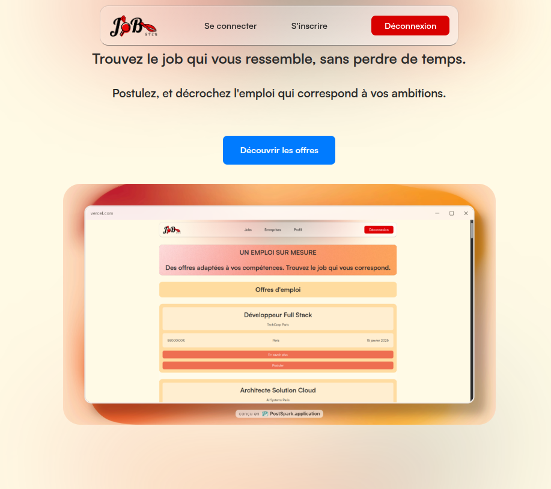
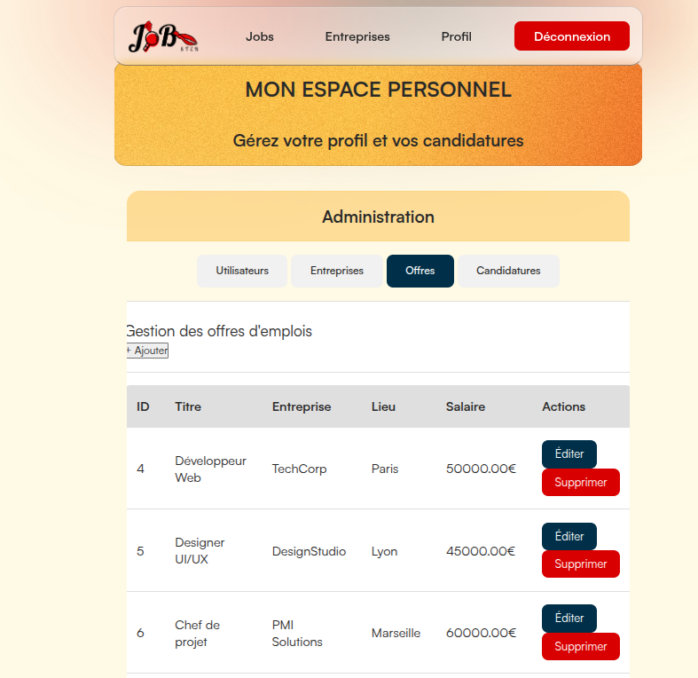

<p align="center">
  
  
  
  
</p>

<p align="center">
  
  
  
  
</p>

<h1 align="center">🚀 JobSter</h1>

<p align="center">
  <b>Plateforme de gestion d'offres d'emploi et de candidatures</b>
</p>

> **Projet Epitech**  
> Premier projet web en équipe, avec un gros focus sur le **design** et l’**expérience utilisateur**.

---

## 🎯 Présentation

JobSter est une application web permettant de :

- 🔎 **Consulter** des offres d’emploi et des entreprises  
- ✍️ **Postuler** à des offres avec un message personnalisé  
- 👤 **Gérer** son profil et ses candidatures  
- 🛠️ **Administrer** la plateforme (espace admin)  

---

## 🎨 Design & UX

Nous avons mis l’accent sur :

- UI moderne et intuitive
- Responsive (mobile / tablette / desktop)
- Animations & transitions fluides
- Palette cohérente
- Typographies personnalisées (**Satoshi**, **Lobster**)

---

## 🛠 Technologies

### Backend
- Node.js
- Express.js
- PostgreSQL
- express-session


### Frontend
- HTML5 / CSS3
- JavaScript (Vanilla)
- Fetch API

---

## ✨ Fonctionnalités

### Utilisateurs (public)
- ✅ Accès aux offres / entreprises
- ✅ Inscription & connexion

### Utilisateurs connectés
- ✅ Gestion du profil
- ✅ Postuler à une offre
- ✅ Suivi des candidatures (pending / accepted / rejected)

### Admin
- ✅ Dashboard admin
- ✅ CRUD utilisateurs / entreprises / offres / candidatures
- ✅ Gestion des statuts de candidatures

---

## 📁 Structure du projet

```txt
T-WEB-501-MPL_7/
├── app.js
├── config/
├── controllers/
├── models/
├── routes/
└── public/
```

---

## 🚀 Installation & lancement en local

### ✅ Prérequis
- Node.js (18+ recommandé)
- PostgreSQL
- Git

### 1) Cloner le projet
```bash
git clone https://github.com/Victor34110/Job-Board.git
cd Job-Board
```

### 2) Installer les dépendances
```bash
npm install
```

### 3) Créer la base PostgreSQL
Dans PostgreSQL :

```sql
CREATE DATABASE jobster;
CREATE USER jobster_user WITH PASSWORD 'motdepassefort';
GRANT ALL PRIVILEGES ON DATABASE jobster TO jobster_user;
```

### 4) Configurer le fichier `.env`
Créer un fichier **.env** à la racine :

```env
DB_USER=jobster_user
DB_PASSWORD=motdepassefort
DB_HOST=localhost
DB_NAME=jobster
DB_PORT=5432

PORT=3000
SESSION_SECRET=change_me
```

### 5) Initialiser les tables et données
Les tables sont créées automatiquement au premier lancement. Vous pouvez insérer des utilisateurs de test :

```sql
INSERT INTO users (first_name, last_name, email, password, role) VALUES
('Admin', 'Jobster', 'admin@jobster.com', 'password123', 'admin'),
('Jean', 'Dupont', 'jean.dupont@email.com', 'password123', 'user'),
('Test', 'User', 'test@test.com', 'test1234', 'user');
```

### 6) Lancer le serveur
```bash
npm start
```

✅ Ensuite ouvre : **http://localhost:3000**

---

## 👤 Inscription / Connexion

### Comptes de test disponibles :

| Email | Mot de passe | Rôle |
|-------|--------------|------|
| `admin@jobster.com` | `password123` | **Admin** - Accès complet |
| `jean.dupont@email.com` | `password123` | **User** - Utilisateur lambda |
| `test@test.com` | `test1234` | **User** - Utilisateur lambda |

Ou vous pouvez vous inscrire via : `http://localhost:3000/register`

---

## 🔑 Fonctionnalités par rôle

### Utilisateur lambda
- ✅ Consulter les offres et entreprises
- ✅ Postuler à une offre
- ✅ Suivre ses candidatures (statut : pending / accepted / rejected)
- ✅ Gérer son profil

### Admin
- ✅ **Dashboard complet** avec onglets : Utilisateurs | Entreprises | Offres | Candidatures
- ✅ **Créer** des entreprises, offres, utilisateurs
- ✅ **Modifier** les éléments (en développement)
- ✅ **Supprimer** des éléments
- ✅ Voir toutes les candidatures
- ✅ Gérer les rôles utilisateurs

---

## 🌐 Pages disponibles

Une fois connecté, tu peux naviguer sur :
- **Accueil** : `/` 
- **Offres d'emploi** : `/jobs`
- **Entreprises** : `/companies`
- **Dashboard** : `/dashboard` (espace utilisateur + admin)
